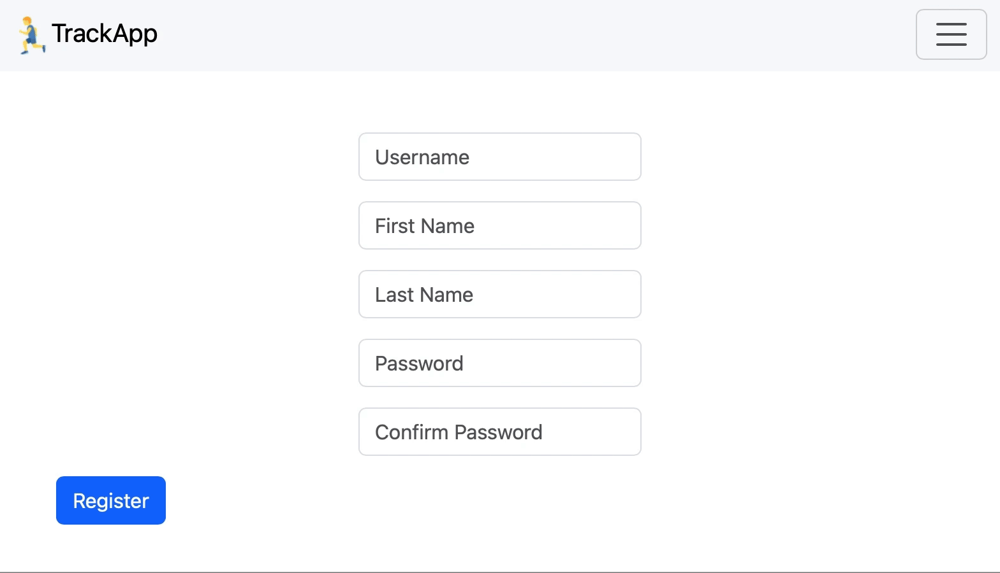

# 🏃🏻 TrackApp, Your Personal Fitness Tracker
#### Video Demo:  [YouTube](https://www.youtube.com/watch?v=wQrDNld70Pw)
## About
TrackApp is your new personal fitness tracker. It is a web application developed using Python, JavaScript, and SQL, that serves as your own activity log for any fitness activity you undertake. It provides a convenient way to upload and keep track of your runs, swims, hikes, and anything in between! It's as easy as creating an account on the website, and navigating to the upload page. Once there you can upload any .FIT file containing data about a workout that you've completed. FIT stands for Flexible and Interoperable Data Transfer files. These files contain a myriad of information, including some key vital signs such as heart rate and blood oxygen levels, and also sweat, power, stride, vertical oscillation, and many more. Once an activity is uploaded, the program will parse the file and add it to your Activity Log, which is a page to keep track of all of the activities you have so far uploaded, including some information such as the date, the distance, name of the activity, and more. The program will also extract GPS data (if included) from the file to produce a map containing the route of the activity. This is especially useful for runs, hikes, and walks, allowing you to revisit special places and keep track of your favourite routes.

This program is comprised of a number of files, the main application residing in `app.py`, a Python file containing the entire backend of the app, along with `trackapp.db`, a SQL database housing the user and activity data for the application. Along with these two files are a number of different HTML templates used to render the login and logout screens, the activity log, the upload page, as well as the activity and edit activity pages. Along with these files there is also `helpers.py`, another Python file containing a few self-created functions that enable the data to be parsed correctly and presented in an appropriate manner.

## Installation and Setup
To run TrackApp locally:
1. Clone this repository.
2. Install the required dependencies using `pip install -r requirements.txt`.
3. Run the app with `flask run` and access it in your browser at `http://127.0.0.1:5000`.

## App Structure
### Registering a New User
\

When registering, we simply need the user to provide a username, first and last name, as well as a password with which to later login again. A new user is added to the `users` table in `trackapp.db` and presented with an empty <b>Activity Log</b> upon their successful login.

### Logging in an Existing User
\

After logging in, the user is presented with the <b>Activity Log</b>. The <b>Activity Log</b> will display some information about the user, such as their first and last name, giving it a more personal touch to the application. And it will show a table with various kinds of data pertaining to the activities that they have uploaded, including: sport (run, hike, walk, etc.) activity name (that the user has chosen themselves when uploading), date recorded, duration, and distance.

### Uploading an Activity
\

In order to upload an activity, the user must navigate to the page via the bar located at the top of the screen. Once on the page, the user is shown 3 input fields along with a submission button. The only required input is the top one for uploading a .FIT file, the name and description are optional and can be added (or edited) after the fact. When an activity is uploaded, the application reads the file into the `activities` table in `trackapp.db` for storage and parses the file using the Python library `fitparse` for metrics such as date, duration, distance, pace, calories, and heart rate. This is done in order to lessen the burden on the application when displaying the activity as all of the stats have been pre-processed and stored. The activity is given an ID number, and is stored alongside the ID of the user that uploaded it.

### Editing an Activity
\

The activity page includes an 'edit activity' button. This will take you to a functionally and visually similar page containing all the data from the activity page, with two input fields for updating the name and description of the activity. This is included as an additional functionality as users may not be aware of what activity belongs to a certain .FIT file. This allows users to add a title and short description later.

### Viewing an Activity
\

Once an activity is uploaded, it redirects you to the activity page. The activity page serves to provide a graphical interface with which to view the .FIT file that was uploaded. The metrics mentioned beforehand are displayed in a small table, and just above this we have a map, showing the GPS route that was recorded (if supplied in the .FIT). This was achieved using some JavaScript, in the form of the Leaflet.js JavaScript library, and using map data from OpenStreetMap.

### Alternate Activity Types
\

TrackApp supports a wide variety of activities and sports. Here we have a static view of an alternative activity. We hope to add some further functionality to enhance this view and include some more relevant statistics.

### Future Functionality

I would also like to mention some additional functionality that I would choose to implement with more time. The application currently supports multiple users, so the development of an activity "feed" with your friends' activities would be valuable. Moreover, I would also like to implement a weekly or monthly goal tracker to inform you whether you are meeting a user-defined distance goal for the current month or week.

## Acknowledgements

I would like to give my final thanks to those who have developed and help maintain the following Python libraries used:

[flask](https://flask.palletsprojects.com/en/stable/)\
[werkzeug.security](https://werkzeug.palletsprojects.com/en/stable/)\
[fitparse](https://github.com/dtcooper/Python-fitparse)

As well as:

[Bootstrap](https://getbootstrap.com)\
[Jinja](https://jinja.palletsprojects.com/en/stable/)\
[Garmin FIT SDK](https://developer.garmin.com/fit/overview/)\
[Leaflet.js](https://leafletjs.com) and\
[OpenStreetMap](https://www.openstreetmap.org/copyright)

And finally to the organisers of the [CS50 course](https://www.edx.org/cs50), David J. Malan, all the teaching assistants, and my [brother](https://github.com/sendelivery) for serving as my faithful rubber duckie.
